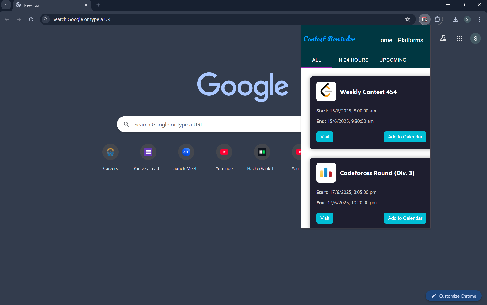
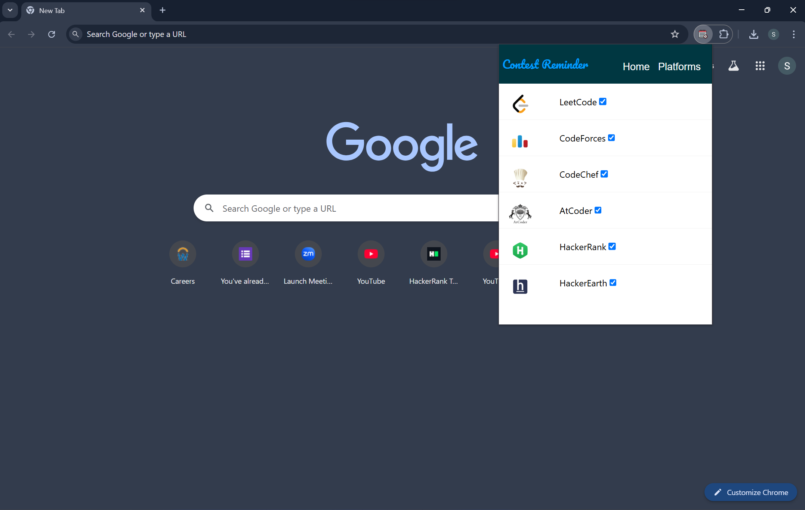
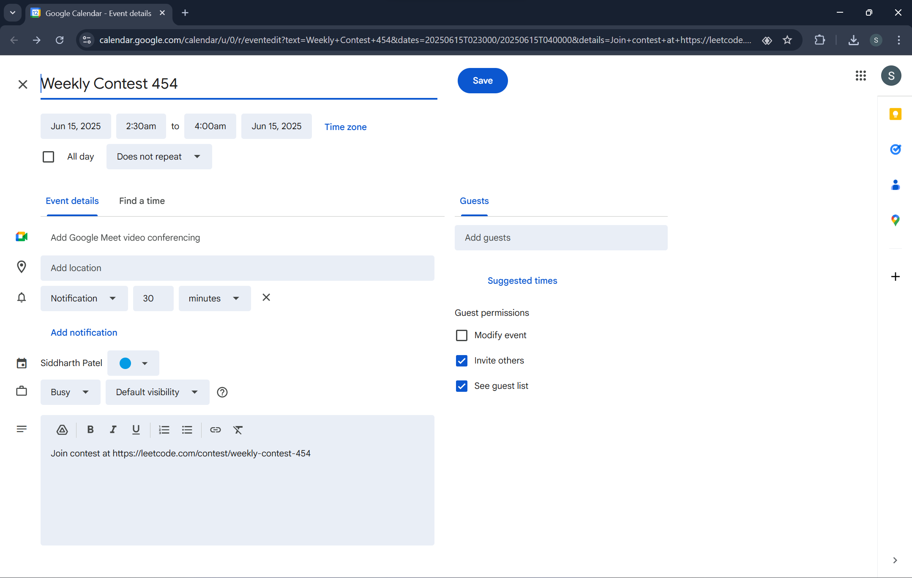

# Contest Reminder

This is a Chrome extension that displays information about all the ongoing and upcoming competitive programming contests.

## Features

* This extension shows the contest details of the following 8 platforms:
  * CodeForces
  * CodeChef
  * LeetCode
  * AtCoder
  * Kick Start
  * HackerRank
  * HackerEarth
  * TopCoder
* Subscribe or Unsubscribe any platform.
* Google Calendar Integration.
* Contest link to register for the contest.

## Screenshots





## Developer Quickstart

Install the required dependencies listed in `package-lock.json` using npm:

```bash
npm install
